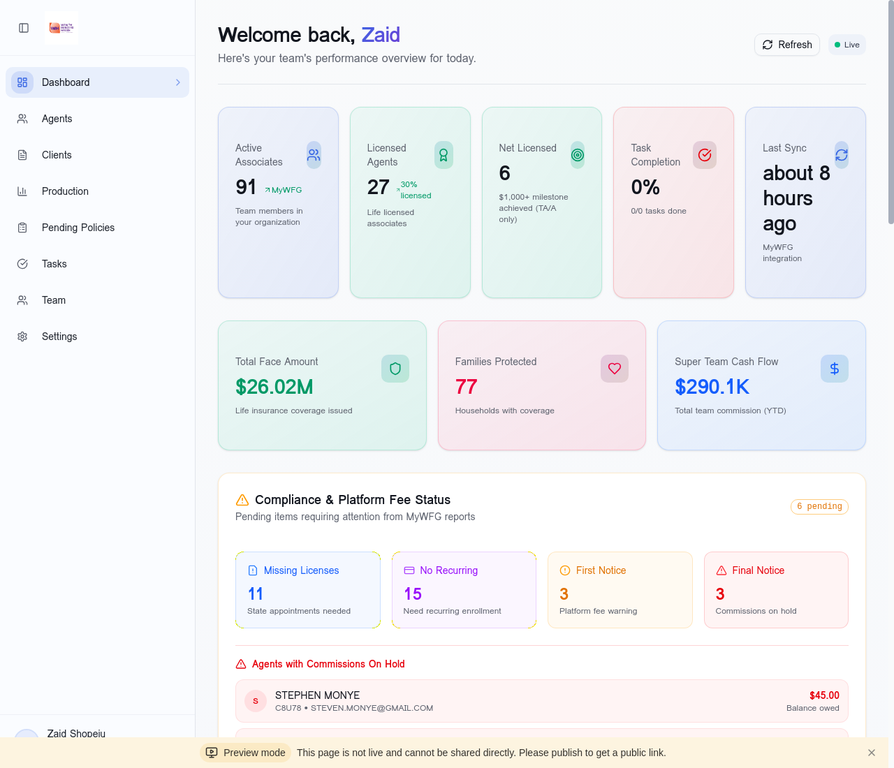

# Tutorial 1: Getting Started with Wealth Builders Haven CRM

**Duration:** 10-15 minutes  
**Skill Level:** Beginner  
**Author:** Manus AI

---

## Introduction

Welcome to the Wealth Builders Haven CRM! This comprehensive guide will walk you through your first login and help you understand the main dashboard. By the end of this tutorial, you'll be comfortable navigating the system and understanding the key metrics that drive your business.

The CRM is designed specifically for WFG (World Financial Group) agents and team leaders to manage their downline, track production, monitor compliance, and automate data synchronization with MyWFG and Transamerica portals.

---

## Prerequisites

Before you begin, ensure you have the following:

| Requirement | Description |
|-------------|-------------|
| Web Browser | Chrome, Firefox, Safari, or Edge (latest version recommended) |
| Internet Connection | Stable broadband connection |
| Login Credentials | Your email and password provided by your administrator |
| MyWFG Account | Optional - for automated data sync features |

---

## Step 1: Accessing the CRM

Open your web browser and navigate to your CRM URL. You will see the landing page for Wealth Builders Haven.

### Finding the Login Portal

1. Look for the **"FINANCIAL PRO"** link in the top navigation menu
2. Click on it to access the protected area
3. If prompted for a password, enter the password provided by your administrator

Alternatively, you can navigate directly to the CRM dashboard URL if you have it bookmarked.

---

## Step 2: Logging In

Once you reach the authentication page, you'll see the sign-in form.

### Login Process

1. **Enter your email address** in the email field
2. **Enter your password** in the password field
3. Click the **"Sign In"** button

If you don't have an account yet, click **"Sign Up"** to create one. You'll need to provide:
- Your full name
- Email address
- A secure password (minimum 8 characters)

> **Security Tip:** Use a strong, unique password that includes uppercase letters, lowercase letters, numbers, and special characters.

---

## Step 3: Understanding the Dashboard

After logging in, you'll be greeted with the main dashboard. This is your command center for managing your WFG business.

### Key Metrics Cards

The dashboard displays six primary metric cards at the top:

| Metric | Description | Data Source |
|--------|-------------|-------------|
| **Active Associates** | Total team members in your organization | MyWFG Downline Status |
| **Licensed Agents** | Associates with life insurance licenses | MyWFG Downline Status |
| **Net Licensed** | TAs/As who achieved $1,000+ production milestone | MyWFG Custom Reports |
| **Task Completion** | Percentage of completed tasks | Internal CRM |
| **Last Sync** | Time since last MyWFG data synchronization | Sync Service |
| **Total Face Amount** | Total life insurance coverage issued | Transamerica |

### Secondary Metrics

Below the primary cards, you'll find additional business metrics:

- **Families Protected:** Number of households with active coverage
- **Super Team Cash Flow:** Total team commission (YTD)

---

## Step 4: Navigating the Sidebar

The left sidebar provides quick access to all major sections of the CRM:

| Menu Item | Purpose |
|-----------|---------|
| **Dashboard** | Main overview with key metrics and alerts |
| **Agents** | Manage your team's recruits and track their progress |
| **Clients** | View and manage policyholders |
| **Production** | Transamerica inforce policies and commission tracking |
| **Pending Policies** | Policies requiring action or documentation |
| **Tasks** | Follow-ups, reminders, and to-do items |
| **Team** | Team hierarchy and commission calculator |
| **Settings** | MyWFG integration and system configuration |

### User Profile

At the bottom of the sidebar, you'll see your user profile showing:
- Your name
- Your role (Administrator, Agent, etc.)
- Click to access profile settings or log out

---

## Step 5: Understanding Compliance Alerts

The dashboard includes a **Compliance & Platform Fee Status** section that shows pending items requiring attention:

### Compliance Categories

1. **Missing Licenses** - State appointments needed for your agents
2. **No Recurring** - Agents who need recurring enrollment for platform fees
3. **First Notice** - Agents with platform fee warnings
4. **Final Notice** - Agents with commissions on hold

Each category shows a count badge, and you can click to see the specific agents affected.

### Agents with Issues

The dashboard lists agents with:
- **Commissions On Hold:** Shows agent name, code, email, and balance owed
- **First Notice Warning:** Shows agents who need to pay platform fees soon

---

## Step 6: Chargeback Alerts

The **Transamerica Chargeback Alerts** section shows critical policy alerts requiring immediate attention:

### Alert Types

| Alert Type | Description | Action Required |
|------------|-------------|-----------------|
| **Reversed Premium Payments** | Client payments that were reversed | Contact client immediately |
| **Removed from EFT** | Clients removed from automatic payments | Re-establish payment method |

> **Important:** Contact these clients immediately to prevent policy lapse and commission chargebacks.

You can click **"Send Alert Notification"** to receive an email summary of all current chargebacks.

---

## Step 7: Quick Actions

At the bottom of the dashboard, you'll find **Quick Actions** buttons for common tasks:

- **Add Agent** - Add a new recruit to your team
- **New Task** - Create a follow-up or reminder
- **Add Client** - Add a new policyholder

These shortcuts help you quickly perform the most common operations without navigating through menus.

---

## Step 8: Refreshing Data

To get the latest data from MyWFG and Transamerica:

1. Click the **"Refresh"** button in the top-right corner of the dashboard
2. For a full sync, scroll down to the **"Automated Data Sync"** section
3. Click **"Trigger Manual Sync"** to pull the latest data

The sync process will:
- Log into MyWFG automatically
- Fetch OTP codes from your Gmail
- Extract agent and production data
- Update the dashboard with fresh information

---

## Troubleshooting Common Issues

### Can't Log In?

1. Verify your email address is correct
2. Check that Caps Lock is not enabled
3. Try resetting your password using the "Forgot Password" link
4. Contact your administrator if issues persist

### Dashboard Shows Old Data?

1. Click the "Refresh" button
2. Check the "Last Sync" timestamp
3. Trigger a manual sync if needed
4. Verify your MyWFG credentials are up to date in Settings

### Missing Metrics?

Some metrics require data from external sources:
- Face Amount requires Transamerica sync
- Active Associates requires MyWFG sync
- Ensure your integration credentials are configured in Settings

---

## Next Steps

Now that you're familiar with the dashboard, proceed to the next tutorials:

1. **Tutorial 2:** Agent Management - Learn to add, edit, and track agents
2. **Tutorial 3:** Production Tracking - Understand commission calculations
3. **Tutorial 4:** Task Management - Stay on top of follow-ups

---

## Summary

In this tutorial, you learned how to:

- ✅ Access and log into the CRM
- ✅ Navigate the main dashboard
- ✅ Understand key business metrics
- ✅ Use the sidebar navigation
- ✅ Monitor compliance alerts
- ✅ Track chargeback warnings
- ✅ Perform quick actions
- ✅ Refresh data from external sources

**Congratulations!** You're now ready to start using the Wealth Builders Haven CRM effectively.

---

*Last Updated: January 2026*
