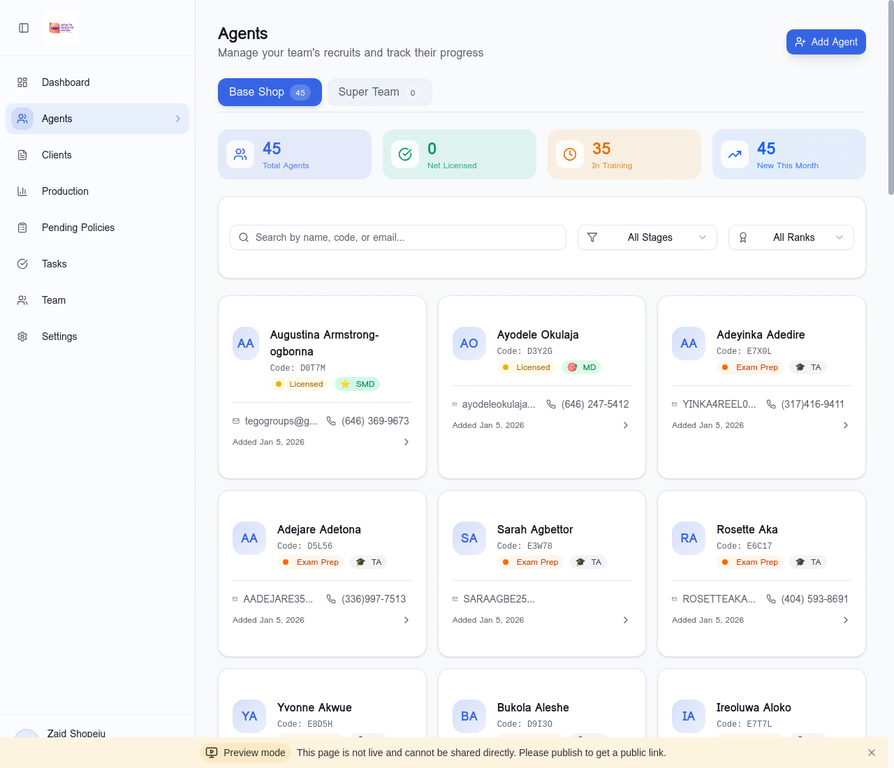
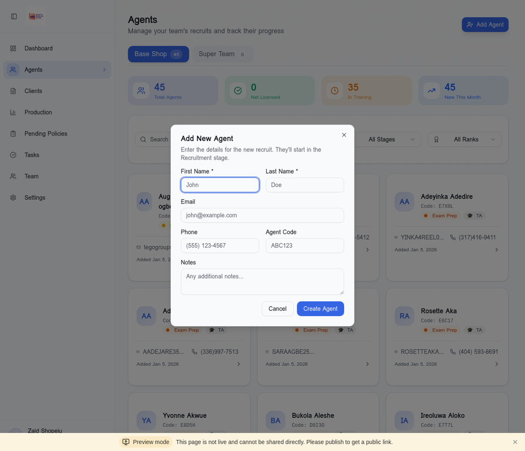
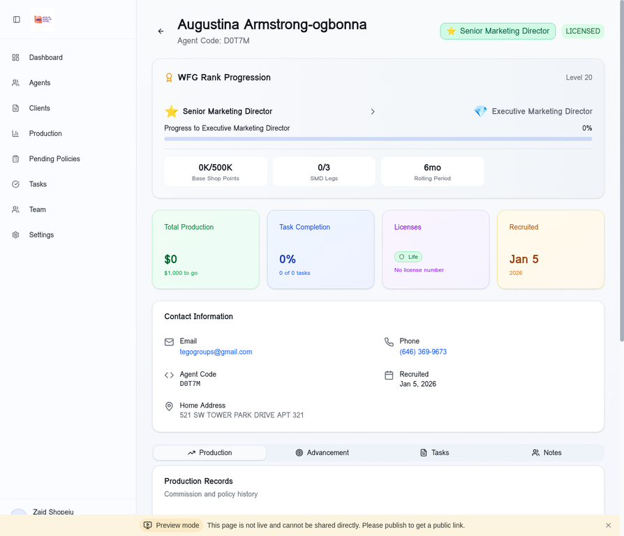

# Tutorial 2: Agent Management

**Duration:** 15-20 minutes  
**Skill Level:** Beginner to Intermediate  
**Author:** Manus AI

---

## Introduction

The Agents module is the heart of your team management in the Wealth Builders Haven CRM. This tutorial will teach you how to add new recruits, track their progress through the WFG system, and manage their journey from recruitment to becoming a fully licensed, producing agent.

Understanding the agent lifecycle is crucial for building a successful WFG organization. Each agent goes through specific stages, and this CRM helps you track and support them at every step.

---

## Understanding the Agent Lifecycle

Before diving into the features, let's understand the stages every agent goes through:

| Stage | Description | Key Milestones |
|-------|-------------|----------------|
| **Recruitment** | Initial contact and sign-up | IBA signed, background check |
| **Exam Prep** | Studying for life insurance exam | Study materials, practice tests |
| **Licensed** | Passed state exam | License number received |
| **Product Training** | Learning WFG products | Transamerica certification |
| **Business Launch** | First client appointments | Field training completed |
| **Net Licensed** | Achieved $1,000+ production | First commission earned |
| **Client Tracking** | Building client base | 10+ active policies |
| **Chargeback Proof** | Sustainable business | 13+ month persistency |

---

## Step 1: Accessing the Agents Page

Navigate to the Agents page by clicking **"Agents"** in the left sidebar.

### Page Overview

The Agents page displays:

1. **Tab Selector:** Toggle between "Base Shop" (your direct recruits) and "Super Team" (your entire downline)
2. **Summary Cards:** Quick stats about your team
3. **Search Bar:** Find agents by name, code, or email
4. **Filter Dropdowns:** Filter by stage or rank
5. **Agent Cards:** Grid of all agents with key information

### Summary Metrics

| Metric | Description |
|--------|-------------|
| **Total Agents** | Number of agents in the selected view |
| **Net Licensed** | Agents who achieved $1,000+ production |
| **In Training** | Agents in Exam Prep or Product Training |
| **New This Month** | Agents added in the current month |

---

## Step 2: Adding a New Agent

When you recruit someone new, add them to the CRM immediately to start tracking their progress.

### Opening the Add Agent Dialog

1. Click the **"+ Add Agent"** button in the top-right corner
2. The Add New Agent dialog will appear

### Required Information

Fill in the following fields:

| Field | Required | Description | Example |
|-------|----------|-------------|---------|
| **First Name** | Yes | Agent's first name | John |
| **Last Name** | Yes | Agent's last name | Doe |
| **Email** | No | Contact email | john@example.com |
| **Phone** | No | Contact phone | (555) 123-4567 |
| **Agent Code** | No | WFG agent code (if assigned) | ABC123 |
| **Notes** | No | Any additional information | Referred by Jane |

### Creating the Agent

1. Fill in all required fields (First Name, Last Name)
2. Add optional contact information
3. Click **"Create Agent"** to save

The new agent will be added to your Base Shop with the default stage of "Recruitment" and rank of "Training Associate (TA)".

> **Best Practice:** Add agents immediately after they sign their IBA. This ensures you can track their entire journey from day one.

---

## Step 3: Viewing Agent Details

Click on any agent card to view their complete profile.

### Profile Header

The header displays:
- **Agent Name** and **Code**
- **Current Rank** (TA, A, SA, MD, SMD, EMD, CEO)
- **License Status** badge

### WFG Rank Progression

This section shows the agent's advancement path:

| Element | Description |
|---------|-------------|
| **Current Rank** | Their current position in the WFG hierarchy |
| **Next Rank** | What they're working toward |
| **Progress Bar** | Visual indicator of advancement progress |
| **Base Shop Points** | Points accumulated toward next rank |
| **SMD Legs** | Number of SMD-qualified legs (for MD+ ranks) |
| **Rolling Period** | Time remaining in current qualification period |

### Quick Stats Cards

Four cards provide at-a-glance information:

1. **Total Production:** Cumulative premium written
2. **Task Completion:** Percentage of assigned tasks completed
3. **Licenses:** Life, Health, Securities licenses held
4. **Recruited:** Date the agent joined your team

### Contact Information

Shows the agent's:
- Email address (clickable to send email)
- Phone number (clickable to call)
- Agent code
- Recruitment date
- Home address (if available)

---

## Step 4: Managing Agent Stages

The **Workflow Timeline** shows the agent's progress through the 8 stages.

### Viewing the Timeline

Scroll down on the agent detail page to see the Workflow Timeline:

| Stage | Status | Description |
|-------|--------|-------------|
| ✓ **RECRUITMENT** | Completed | Agent has signed up |
| ✓ **EXAM PREP** | Completed | Studying for license exam |
| ✓ **LICENSED** | Completed | Passed state exam |
| ○ **PRODUCT TRAINING** | Pending | Learning WFG products |
| ○ **BUSINESS LAUNCH** | Pending | First client appointments |
| ○ **NET LICENSED** | Pending | $1,000+ production |
| ○ **CLIENT TRACKING** | Pending | Building client base |
| ○ **CHARGEBACK PROOF** | Pending | Sustainable business |

### Advancing Stages

Stages are automatically updated based on:
- **MyWFG sync data** for license status
- **Transamerica sync** for production milestones
- **Manual updates** for training completion

To manually update a stage:
1. Click on the stage in the timeline
2. Confirm the stage completion
3. The system will record the completion date

---

## Step 5: Using the Agent Tabs

The agent detail page has four tabs for different information:

### Production Tab

Shows the agent's policy history:
- List of all policies written
- Premium amounts and commission
- Policy status (Active, Lapsed, etc.)
- Commission calculations

### Advancement Tab

Displays rank progression details:
- Current rank requirements
- Progress toward next rank
- Historical rank changes
- Qualification criteria

### Tasks Tab

Lists tasks assigned to this agent:
- Pending tasks with due dates
- Completed tasks history
- Quick add new task button

### Notes Tab

Free-form notes about the agent:
- Meeting notes
- Training observations
- Personal information
- Important reminders

---

## Step 6: Searching and Filtering

With a large team, finding specific agents quickly is essential.

### Using the Search Bar

Type in the search bar to find agents by:
- **Name:** First or last name
- **Code:** WFG agent code
- **Email:** Email address

The results update in real-time as you type.

### Filtering by Stage

Click the **"All Stages"** dropdown to filter by:
- Recruitment
- Exam Prep
- Licensed
- Product Training
- Business Launch
- Net Licensed
- Client Tracking
- Chargeback Proof

### Filtering by Rank

Click the **"All Ranks"** dropdown to filter by:
- TA (Training Associate)
- A (Associate)
- SA (Senior Associate)
- MD (Marketing Director)
- SMD (Senior Marketing Director)
- EMD (Executive Marketing Director)
- CEO

---

## Step 7: Base Shop vs Super Team

The CRM distinguishes between two views:

### Base Shop

Your **direct recruits** - agents you personally recruited:
- Shows only agents where you are the direct upline
- These are your personal responsibility
- Focus on these for hands-on training

### Super Team

Your **entire downline** - includes all levels:
- Shows agents recruited by your recruits
- Gives you visibility into your organization's depth
- Useful for identifying future leaders

Toggle between views using the tabs at the top of the Agents page.

---

## Step 8: Editing Agent Information

To update an agent's information:

1. Click on the agent card to open their profile
2. Click the **"Edit"** button (pencil icon) in the header
3. Modify the desired fields
4. Click **"Save Changes"**

### Editable Fields

| Field | Notes |
|-------|-------|
| Name | First and last name |
| Email | Contact email address |
| Phone | Primary phone number |
| Agent Code | WFG-assigned code |
| Address | Home or mailing address |
| Notes | Free-form text field |

### Non-Editable Fields

Some fields are synced from MyWFG and cannot be manually edited:
- Rank (synced from MyWFG)
- License status (synced from MyWFG)
- Production data (synced from Transamerica)

---

## Step 9: Understanding Rank Icons

Each rank has a distinctive icon for quick identification:

| Icon | Rank | Level | Commission % |
|------|------|-------|--------------|
| 🎓 | Training Associate (TA) | 1-4 | 25% |
| 📋 | Associate (A) | 5-9 | 35% |
| 📊 | Senior Associate (SA) | 10-14 | 45% |
| 🎯 | Marketing Director (MD) | 15-19 | 50% |
| ⭐ | Senior Marketing Director (SMD) | 20-24 | 55% |
| 💎 | Executive Marketing Director (EMD) | 25-29 | 60% |
| 👑 | CEO | 30+ | 65% |

---

## Step 10: Best Practices for Agent Management

### Daily Habits

1. **Check new agents** - Review any agents added in the last 24 hours
2. **Monitor exam prep** - Follow up with agents studying for exams
3. **Track first-month agents** - New agents need the most attention

### Weekly Reviews

1. **Stage advancement** - Identify agents ready to move to next stage
2. **Task completion** - Check pending tasks for each agent
3. **Production updates** - Review who's writing business

### Monthly Analysis

1. **Rank progression** - Who's close to advancing?
2. **Retention** - Any agents at risk of leaving?
3. **Training needs** - Who needs additional support?

---

## Troubleshooting

### Agent Not Showing Up?

1. Check if you're viewing "Base Shop" vs "Super Team"
2. Clear any active filters
3. Search by email or code instead of name
4. Verify the agent was created successfully

### Wrong Stage Displayed?

1. Trigger a MyWFG sync to update data
2. Check if the stage was manually overridden
3. Verify license status in MyWFG portal

### Missing Production Data?

1. Ensure Transamerica sync is configured
2. Check if the policy is under the correct agent code
3. Verify the policy is active (not pending)

---

## Next Steps

Now that you understand agent management, continue to:

1. **Tutorial 3:** Production Tracking - Monitor commissions and policies
2. **Tutorial 4:** Task Management - Create and assign follow-ups
3. **Tutorial 5:** Team Hierarchy - View your organization structure

---

## Summary

In this tutorial, you learned how to:

- ✅ Navigate the Agents page
- ✅ Add new recruits to your team
- ✅ View and understand agent profiles
- ✅ Track agents through the 8-stage workflow
- ✅ Use the Production, Advancement, Tasks, and Notes tabs
- ✅ Search and filter your agent list
- ✅ Distinguish between Base Shop and Super Team
- ✅ Edit agent information
- ✅ Understand rank icons and commission levels

**Great job!** You're now equipped to effectively manage your WFG team.

---

*Last Updated: January 2026*
