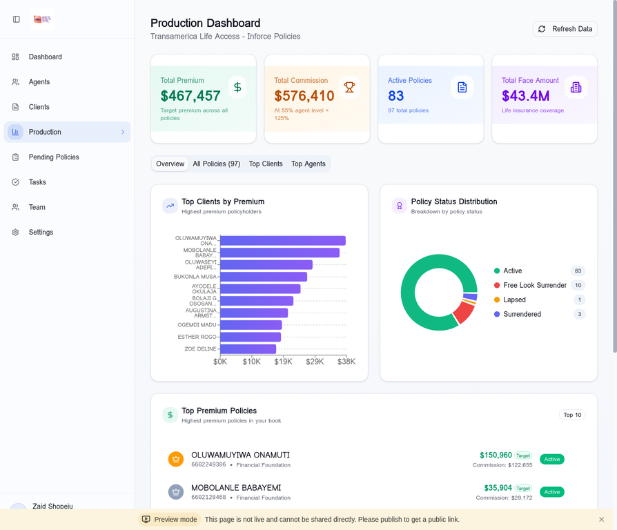

# Tutorial 3: Production Tracking & Commission Calculations

**Duration:** 15-20 minutes  
**Skill Level:** Intermediate  
**Author:** Manus AI

---

## Introduction

The Production Dashboard is your financial command center. It displays all inforce policies from Transamerica, calculates commissions based on WFG's compensation structure, and helps you identify your top-performing agents and clients.

Understanding how commissions are calculated is essential for forecasting income and motivating your team. This tutorial will demystify the WFG commission structure and show you how to use the Production Dashboard effectively.

---

## Understanding WFG Commission Structure

Before diving into the dashboard, let's understand how WFG commissions work:

### The Commission Formula

```
Commission = Target Premium × 125% × Agent Level % × Split %
```

| Component | Description | Example |
|-----------|-------------|---------|
| **Target Premium** | Annual premium amount | $10,000 |
| **125% Multiplier** | WFG's standard multiplier | × 1.25 = $12,500 |
| **Agent Level %** | Based on rank (25%-65%) | × 55% = $6,875 |
| **Split %** | If policy is split between agents | × 100% = $6,875 |

### Commission Levels by Rank

| Rank | Level | Commission % |
|------|-------|--------------|
| Training Associate (TA) | 1-4 | 25% |
| Associate (A) | 5-9 | 35% |
| Senior Associate (SA) | 10-14 | 45% |
| Marketing Director (MD) | 15-19 | 50% |
| Senior Marketing Director (SMD) | 20-24 | 65% |
| Executive Marketing Director (EMD) | 25-29 | 65% |
| CEO | 30+ | 65% |

---

## Step 1: Accessing the Production Dashboard

Navigate to **Production** in the left sidebar.



### Dashboard Overview

The Production Dashboard displays:

1. **Summary Cards** - Key financial metrics
2. **Tab Navigation** - Different views of your data
3. **Charts** - Visual representations of production
4. **Policy Lists** - Detailed policy information

---

## Step 2: Understanding Summary Cards

The top of the dashboard shows four key metrics:

### Total Premium

This is the sum of all target premiums across your policies.

| Metric | Description |
|--------|-------------|
| **Value** | Total annual premium from all policies |
| **Source** | Transamerica inforce data |
| **Update Frequency** | Each sync with Transamerica |

### Total Commission

Your estimated commission based on current policies.

| Calculation | Formula |
|-------------|---------|
| **Base** | Total Premium × 125% |
| **Your Share** | Base × Your Level % |
| **Example** | $467,457 × 1.25 × 65% = $379,808 |

> **Note:** The dashboard shows commission at the SMD level (65%) by default. Individual agent commissions vary by rank.

### Active Policies

Count of policies currently in force.

| Status | Description |
|--------|-------------|
| **Active** | Policies with current premium payments |
| **Total** | All policies including lapsed/surrendered |

### Total Face Amount

The total death benefit coverage across all policies.

| Metric | Description |
|--------|-------------|
| **Value** | Sum of all policy face amounts |
| **Format** | Displayed in millions (e.g., $43.4M) |

---

## Step 3: Using the Overview Tab

The Overview tab provides a comprehensive snapshot of your production.

### Top Clients by Premium Chart

A horizontal bar chart showing your highest-premium clients:
- Sorted by premium amount (highest first)
- Shows client name and premium value
- Helps identify your most valuable relationships

### Policy Status Distribution

A donut chart showing policy health:

| Status | Description | Color |
|--------|-------------|-------|
| **Active** | Policies in good standing | Green |
| **Free Look Surrender** | Cancelled within free look period | Orange |
| **Lapsed** | Missed payments, policy inactive | Yellow |
| **Surrendered** | Client cancelled policy | Blue |

### Top Premium Policies

A ranked list of your highest-premium policies:

| Column | Description |
|--------|-------------|
| **Rank** | Position by premium amount |
| **Client Name** | Policyholder name |
| **Policy Number** | Transamerica policy ID |
| **Product** | Policy type (e.g., Financial Foundation) |
| **Target Premium** | Annual premium amount |
| **Commission** | Calculated commission |
| **Status** | Active, Lapsed, etc. |

---

## Step 4: Viewing All Policies

Click the **"All Policies"** tab to see every policy in your book.

### Policy List Features

The complete policy list includes:

| Feature | Description |
|---------|-------------|
| **Search** | Find policies by client name or number |
| **Sort** | Click column headers to sort |
| **Filter** | Filter by status or agent |
| **Export** | Download data for external analysis |

### Policy Details

Click any policy row to see full details:

| Field | Description |
|-------|-------------|
| **Policy Number** | Transamerica policy ID |
| **Client Name** | Policyholder's full name |
| **Product Type** | Financial Foundation, etc. |
| **Face Amount** | Death benefit |
| **Target Premium** | Annual premium |
| **Modal Premium** | Payment per period |
| **Payment Mode** | Monthly, Quarterly, Annual |
| **Issue Date** | When policy was issued |
| **Status** | Current policy status |
| **Writing Agent** | Agent who wrote the policy |
| **Commission** | Calculated commission amount |

---

## Step 5: Analyzing Top Clients

The **"Top Clients"** tab helps you identify your most valuable relationships.

### Why This Matters

Top clients represent:
- Highest revenue potential
- Greatest retention priority
- Best referral sources
- Most important relationships to nurture

### Client Metrics

| Metric | Description |
|--------|-------------|
| **Total Premium** | Sum of all policies for this client |
| **Policy Count** | Number of policies held |
| **Average Premium** | Premium per policy |
| **Tenure** | How long they've been a client |

### Action Items

For each top client, consider:
1. **Annual Review** - Schedule policy review meeting
2. **Referral Request** - Ask for introductions
3. **Coverage Gap Analysis** - Identify additional needs
4. **Birthday/Anniversary** - Personal touch points

---

## Step 6: Reviewing Top Agents

The **"Top Agents"** tab shows production by writing agent.

### Agent Production Metrics

| Column | Description |
|--------|-------------|
| **Agent Name** | Writing agent's name |
| **Agent Code** | WFG agent code |
| **Policy Count** | Number of policies written |
| **Average Level** | Agent's commission level |
| **Total Commission** | Commission earned |
| **Total Premium** | Premium written |

### Using This Data

Top agent analysis helps you:
- Identify your best producers
- Recognize and reward performance
- Understand team production distribution
- Set realistic goals for other agents

---

## Step 7: Understanding Commission Calculations

Let's walk through a real commission calculation example.

### Example Policy

| Field | Value |
|-------|-------|
| Client | John Smith |
| Target Premium | $10,000/year |
| Writing Agent | Jane Doe (SA) |
| Agent Level | 45% |
| Split | 100% (no split) |

### Calculation Steps

1. **Start with Target Premium:** $10,000
2. **Apply 125% Multiplier:** $10,000 × 1.25 = $12,500
3. **Apply Agent Level:** $12,500 × 45% = $5,625
4. **Apply Split:** $5,625 × 100% = $5,625

**Jane's Commission: $5,625**

### Split Policy Example

If the policy is split 60/40 between two agents:

| Agent | Level | Split | Commission |
|-------|-------|-------|------------|
| Jane (SA) | 45% | 60% | $12,500 × 45% × 60% = $3,375 |
| Bob (TA) | 25% | 40% | $12,500 × 25% × 40% = $1,250 |

---

## Step 8: Refreshing Production Data

To get the latest data from Transamerica:

### Manual Refresh

1. Click the **"Refresh Data"** button in the top-right
2. Wait for the sync to complete (30-60 seconds)
3. The dashboard will update with new data

### Automatic Sync

Production data syncs automatically:
- Daily at 6:00 AM (configurable)
- After each manual trigger
- When new policies are detected

### Sync Status

Check the last sync time in the Settings page:
- **Last Sync:** Timestamp of last successful sync
- **Status:** SUCCESS or FAILED
- **Records Processed:** Number of policies updated

---

## Step 9: Bulk Update Feature

For large teams, use the Bulk Update feature to update multiple policies at once.

### Accessing Bulk Update

1. Click **"Bulk Update"** button (if available)
2. Select policies to update
3. Choose the update action
4. Confirm changes

### Available Actions

| Action | Description |
|--------|-------------|
| **Update Agent** | Reassign policies to different agent |
| **Update Status** | Mark policies as reviewed |
| **Export Selected** | Download selected policies |

---

## Step 10: Production Best Practices

### Daily Monitoring

1. Check for new policies
2. Review any status changes
3. Identify policies at risk (payment issues)

### Weekly Analysis

1. Compare production to goals
2. Identify top performers
3. Review commission projections

### Monthly Review

1. Analyze trends over time
2. Calculate team production totals
3. Prepare recognition for top producers

---

## Troubleshooting

### Missing Policies?

1. Verify the policy is issued (not pending)
2. Check that the agent code matches
3. Trigger a manual sync
4. Contact support if issues persist

### Wrong Commission Amount?

1. Verify the agent's current level
2. Check for split percentages
3. Confirm the target premium is correct
4. Review the calculation formula

### Data Not Updating?

1. Check Transamerica credentials in Settings
2. Verify the sync is completing successfully
3. Review sync logs for errors
4. Contact support if needed

---

## Next Steps

Continue your learning with:

1. **Tutorial 4:** Task Management - Create follow-ups for policy reviews
2. **Tutorial 5:** Team Hierarchy - View commission overrides
3. **Tutorial 6:** Pending Policies - Track policies in underwriting

---

## Summary

In this tutorial, you learned:

- ✅ How WFG commissions are calculated
- ✅ Understanding the commission formula
- ✅ Navigating the Production Dashboard
- ✅ Interpreting summary metrics
- ✅ Using the Overview, All Policies, Top Clients, and Top Agents tabs
- ✅ Performing commission calculations
- ✅ Refreshing production data
- ✅ Using bulk update features
- ✅ Production monitoring best practices

**Excellent work!** You now have a solid understanding of production tracking and commission calculations.

---

*Last Updated: January 2026*
