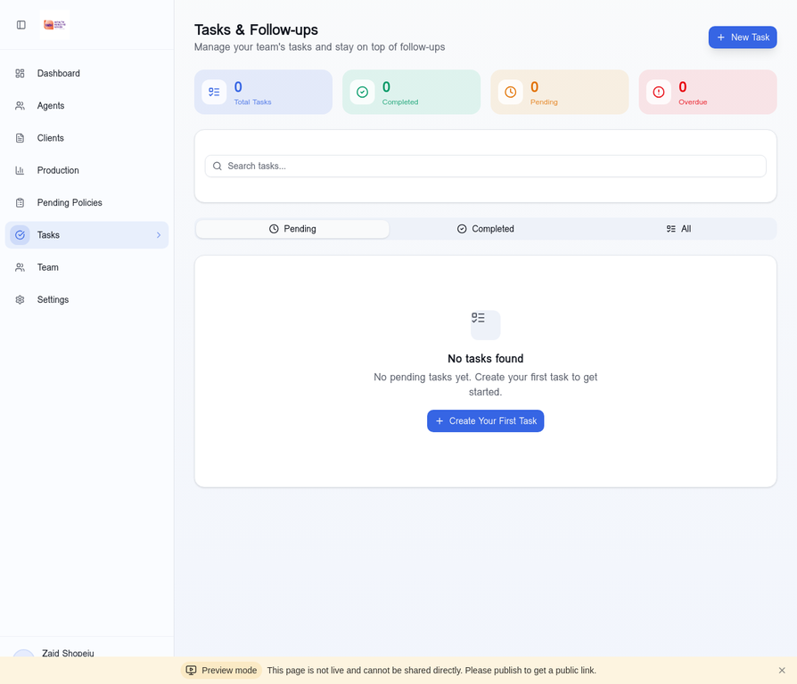

# Tutorial 4: Task Management & Follow-ups

**Duration:** 10-15 minutes  
**Skill Level:** Beginner  
**Author:** Manus AI

---

## Introduction

Effective task management is the backbone of a successful WFG business. The Tasks module helps you stay organized, never miss a follow-up, and ensure every agent and client receives the attention they need.

This tutorial will show you how to create, manage, and complete tasks efficiently.

---

## Why Task Management Matters

In the WFG business, you're juggling multiple responsibilities:

| Responsibility | Examples |
|----------------|----------|
| **Agent Development** | Training calls, exam prep check-ins, field training |
| **Client Service** | Policy reviews, claims assistance, renewals |
| **Compliance** | License renewals, CE credits, platform fees |
| **Business Building** | Recruiting calls, presentations, follow-ups |

Without a system, important items fall through the cracks. The Tasks module ensures nothing is forgotten.

---

## Step 1: Accessing the Tasks Page

Navigate to **Tasks** in the left sidebar.

### Page Overview

The Tasks page displays:

1. **Summary Cards** - Quick stats about your tasks
2. **Search Bar** - Find specific tasks
3. **Tab Navigation** - Filter by status
4. **Task List** - All your tasks

### Summary Metrics

| Metric | Description |
|--------|-------------|
| **Total Tasks** | All tasks in the system |
| **Completed** | Tasks marked as done |
| **Pending** | Tasks not yet completed |
| **Overdue** | Tasks past their due date |

---

## Step 2: Creating a New Task

Click the **"+ New Task"** button to create a task.

### Task Creation Form

| Field | Required | Description |
|-------|----------|-------------|
| **Title** | Yes | Brief description of the task |
| **Description** | No | Detailed notes or instructions |
| **Due Date** | No | When the task should be completed |
| **Priority** | No | Low, Medium, or High |
| **Assigned Agent** | No | Link to a specific agent |
| **Assigned Client** | No | Link to a specific client |

### Example Tasks

| Task Type | Title Example | Due Date |
|-----------|---------------|----------|
| **Follow-up** | Call John about policy review | Tomorrow |
| **Training** | Schedule field training with Sarah | This week |
| **Compliance** | Remind Mike about platform fee | End of month |
| **Recruiting** | Follow up with prospect Jane | Today |

---

## Step 3: Understanding Task Priorities

Prioritize tasks to focus on what matters most:

| Priority | Color | When to Use |
|----------|-------|-------------|
| **High** | Red | Urgent, time-sensitive items |
| **Medium** | Yellow | Important but not urgent |
| **Low** | Green | Nice to do when time permits |

### Priority Guidelines

**High Priority:**
- Overdue items
- Compliance deadlines
- Client emergencies
- Policy at risk of lapse

**Medium Priority:**
- Scheduled follow-ups
- Training sessions
- Regular check-ins

**Low Priority:**
- General reminders
- Future planning
- Nice-to-have items

---

## Step 4: Filtering and Searching Tasks

### Using Tabs

| Tab | Shows |
|-----|-------|
| **Pending** | Tasks not yet completed |
| **Completed** | Tasks marked as done |
| **All** | Every task regardless of status |

### Search Functionality

Type in the search bar to find tasks by:
- Task title
- Description content
- Agent name
- Client name

---

## Step 5: Completing Tasks

When you finish a task:

1. Click on the task to open it
2. Click the **"Mark Complete"** button
3. The task moves to the Completed tab

### Completion Notes

When completing a task, you can add notes:
- What was accomplished
- Any follow-up needed
- Important information learned

---

## Step 6: Editing and Deleting Tasks

### Editing a Task

1. Click on the task to open it
2. Click the **"Edit"** button
3. Modify the desired fields
4. Click **"Save Changes"**

### Deleting a Task

1. Click on the task to open it
2. Click the **"Delete"** button
3. Confirm the deletion

> **Warning:** Deleted tasks cannot be recovered. Consider marking as complete instead for record-keeping.

---

## Step 7: Task Templates (Best Practices)

Create consistent tasks using these templates:

### New Agent Onboarding Tasks

| Task | Due | Priority |
|------|-----|----------|
| Send welcome email | Day 1 | High |
| Schedule orientation call | Day 1 | High |
| Provide study materials | Day 2 | High |
| First check-in call | Day 3 | Medium |
| Weekly progress review | Day 7 | Medium |
| Exam prep assessment | Day 14 | Medium |

### Policy Follow-up Tasks

| Task | Due | Priority |
|------|-----|----------|
| Confirm policy received | 1 week after issue | Medium |
| First payment confirmation | 1 month after issue | High |
| 90-day check-in | 90 days after issue | Medium |
| Annual review | 11 months after issue | Medium |

### Compliance Tasks

| Task | Due | Priority |
|------|-----|----------|
| License renewal reminder | 60 days before expiry | High |
| CE credit check | Quarterly | Medium |
| Platform fee reminder | Monthly | Medium |

---

## Step 8: Linking Tasks to Agents and Clients

Tasks can be linked to specific agents or clients for context.

### Benefits of Linking

1. **Context:** See all tasks for a specific person
2. **History:** Track interactions over time
3. **Accountability:** Know who needs attention
4. **Reporting:** Analyze task patterns

### How to Link

When creating a task:
1. Click **"Assign to Agent"** dropdown
2. Select the relevant agent
3. Or click **"Assign to Client"** for client tasks

---

## Step 9: Managing Overdue Tasks

Overdue tasks require immediate attention.

### Identifying Overdue Tasks

- The **Overdue** count in summary cards shows total
- Overdue tasks display with a red indicator
- They appear at the top of the Pending list

### Handling Overdue Tasks

| Option | When to Use |
|--------|-------------|
| **Complete** | If the task was done but not marked |
| **Reschedule** | If still needed but date passed |
| **Delete** | If no longer relevant |

---

## Step 10: Task Management Best Practices

### Daily Routine

1. **Morning Review:** Check today's tasks first thing
2. **Prioritize:** Focus on high-priority items
3. **Complete:** Mark tasks done as you finish them
4. **Plan:** Add new tasks as they arise

### Weekly Routine

1. **Review Overdue:** Address any overdue items
2. **Plan Ahead:** Schedule tasks for next week
3. **Clean Up:** Delete or reschedule stale tasks

### Monthly Routine

1. **Analyze Patterns:** What tasks recur?
2. **Create Templates:** Standardize common tasks
3. **Review Completion Rate:** Are you staying on top?

---

## Troubleshooting

### Tasks Not Showing?

1. Check the current tab (Pending vs Completed)
2. Clear any search filters
3. Refresh the page

### Can't Create Task?

1. Ensure title is filled in
2. Check for validation errors
3. Try refreshing the page

### Due Date Issues?

1. Verify the date format
2. Check your timezone settings
3. Ensure date is in the future for new tasks

---

## Next Steps

Continue learning with:

1. **Tutorial 5:** Team Hierarchy - Understand your organization structure
2. **Tutorial 6:** Settings & Integration - Configure MyWFG sync
3. **Tutorial 7:** Pending Policies - Track underwriting status

---

## Summary

In this tutorial, you learned:

- ✅ Why task management is essential
- ✅ Navigating the Tasks page
- ✅ Creating new tasks with all fields
- ✅ Understanding task priorities
- ✅ Filtering and searching tasks
- ✅ Completing and editing tasks
- ✅ Using task templates
- ✅ Linking tasks to agents and clients
- ✅ Managing overdue tasks
- ✅ Task management best practices

**Well done!** You're now equipped to stay organized and never miss a follow-up.

---

*Last Updated: January 2026*
