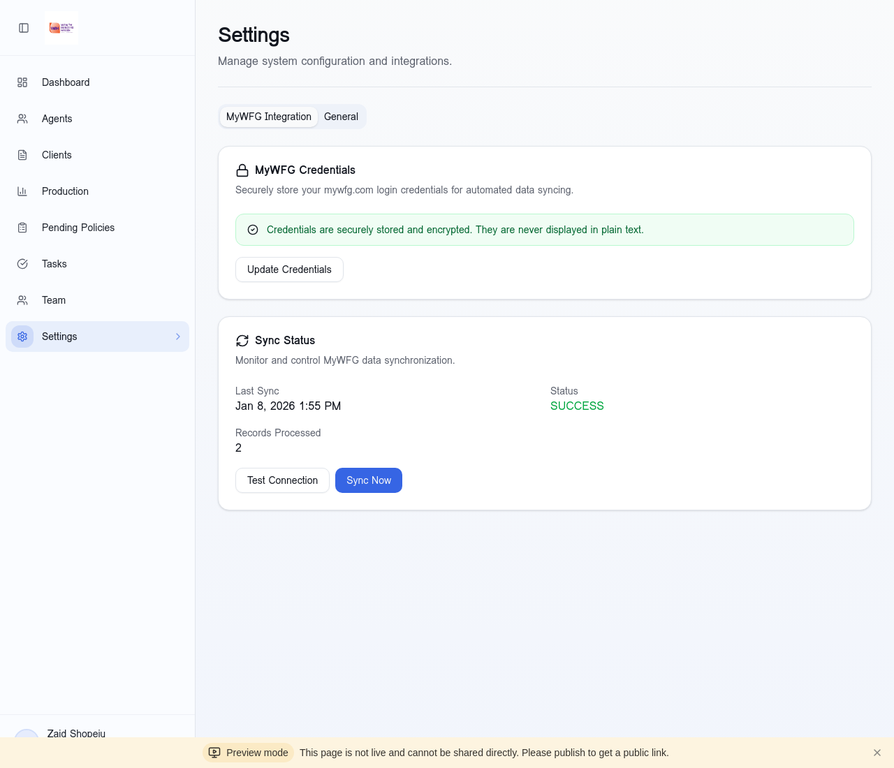

# Tutorial 5: Settings & MyWFG Integration

**Duration:** 10-15 minutes  
**Skill Level:** Intermediate  
**Author:** Manus AI

---

## Introduction

The Settings page is where you configure the CRM's integration with external systems like MyWFG and Transamerica. Proper configuration enables automated data synchronization, keeping your CRM up-to-date without manual data entry.

This tutorial covers setting up credentials, understanding sync status, and troubleshooting integration issues.

---

## Understanding Integrations

The CRM integrates with two primary external systems:

| System | Data Provided | Sync Frequency |
|--------|---------------|----------------|
| **MyWFG** | Agent hierarchy, ranks, licenses, compliance | Daily |
| **Transamerica** | Inforce policies, production, pending apps | Daily |

### Benefits of Integration

1. **Automated Updates:** No manual data entry
2. **Real-time Data:** Always current information
3. **Accuracy:** Eliminates human error
4. **Time Savings:** Hours saved weekly

---

## Step 1: Accessing Settings

Navigate to **Settings** in the left sidebar.

### Settings Tabs

| Tab | Purpose |
|-----|---------|
| **MyWFG Integration** | Configure MyWFG credentials and sync |
| **General** | General CRM settings |

---

## Step 2: MyWFG Credentials Setup

The MyWFG Integration section manages your portal credentials.

### Security Notice

> **Important:** Credentials are securely stored and encrypted. They are never displayed in plain text after saving.

### Adding Credentials

1. Click **"Add MyWFG Credentials"** or **"Update Credentials"**
2. Enter your MyWFG username
3. Enter your MyWFG password
4. Click **"Save Credentials"**

### Credential Fields

| Field | Description |
|-------|-------------|
| **Username** | Your MyWFG login email |
| **Password** | Your MyWFG password |

### After Saving

Once saved, you'll see:
- "Credentials are securely stored and encrypted"
- "Update Credentials" button for changes
- Sync status information

---

## Step 3: Understanding Sync Status

The Sync Status section shows the health of your integration.

### Status Indicators

| Status | Meaning | Action |
|--------|---------|--------|
| **SUCCESS** | Last sync completed successfully | None needed |
| **FAILED** | Last sync encountered errors | Check credentials |
| **PENDING** | Sync is currently running | Wait for completion |

### Sync Metrics

| Metric | Description |
|--------|-------------|
| **Last Sync** | Date and time of last sync |
| **Status** | SUCCESS, FAILED, or PENDING |
| **Records Processed** | Number of records updated |

---

## Step 4: Testing Connection

Before running a full sync, test your credentials.

### Test Connection Process

1. Click **"Test Connection"** button
2. Wait for the test to complete (10-30 seconds)
3. Review the result

### Test Results

| Result | Meaning |
|--------|---------|
| **Connection Successful** | Credentials are valid |
| **Connection Failed** | Check username/password |
| **OTP Required** | System will auto-fetch from Gmail |

---

## Step 5: Running Manual Sync

To immediately sync data:

1. Click **"Sync Now"** button
2. The sync process begins automatically
3. Wait for completion (1-5 minutes)

### What Happens During Sync

1. **Login:** System logs into MyWFG
2. **OTP:** If required, fetches code from Gmail
3. **Navigation:** Accesses relevant data pages
4. **Extraction:** Pulls agent and production data
5. **Update:** Saves data to CRM database
6. **Complete:** Updates sync status

### Sync Progress

During sync, you may see:
- "Connecting to MyWFG..."
- "Fetching OTP from email..."
- "Extracting agent data..."
- "Sync complete!"

---

## Step 6: Automatic OTP Handling

The CRM automatically handles MyWFG's two-factor authentication.

### How It Works

1. MyWFG sends OTP to your registered email
2. CRM connects to your Gmail via IMAP
3. Reads the OTP from the email
4. Enters the code automatically
5. Continues with the sync

### Requirements

For automatic OTP to work:
- Gmail account must be configured
- IMAP access must be enabled
- App password must be set up (if 2FA enabled)

### Gmail Configuration

| Setting | Value |
|---------|-------|
| **IMAP Server** | imap.gmail.com |
| **Port** | 993 |
| **Security** | SSL/TLS |
| **Email** | Your Gmail address |
| **Password** | App password (not regular password) |

---

## Step 7: Scheduled Sync

The CRM can automatically sync on a schedule.

### Default Schedule

| Sync Type | Time | Frequency |
|-----------|------|-----------|
| **MyWFG** | 6:00 AM | Daily |
| **Transamerica** | 6:30 AM | Daily |

### Modifying Schedule

To change the sync schedule:
1. Contact your administrator
2. Or modify the cron job configuration

---

## Step 8: Troubleshooting Sync Issues

### Common Issues and Solutions

| Issue | Possible Cause | Solution |
|-------|----------------|----------|
| **Login Failed** | Wrong credentials | Update username/password |
| **OTP Timeout** | Email delay | Wait and retry |
| **Session Expired** | Long sync time | Retry sync |
| **No Data** | Account permissions | Check MyWFG access |

### Checking Sync Logs

For detailed troubleshooting:
1. Check the sync status on Settings page
2. Review error messages
3. Contact support if issues persist

### Credential Issues

If credentials aren't working:
1. Verify you can log into MyWFG manually
2. Check for password changes
3. Ensure account isn't locked
4. Update credentials in CRM

---

## Step 9: General Settings

The General tab contains additional configuration options.

### Available Settings

| Setting | Description |
|---------|-------------|
| **Notification Email** | Where to send alerts |
| **Timezone** | Your local timezone |
| **Date Format** | MM/DD/YYYY or DD/MM/YYYY |

---

## Step 10: Best Practices

### Credential Security

1. **Use Strong Passwords:** Complex, unique passwords
2. **Regular Updates:** Change passwords periodically
3. **Monitor Access:** Check for unauthorized logins
4. **Enable 2FA:** On both MyWFG and Gmail

### Sync Maintenance

1. **Monitor Status:** Check sync status regularly
2. **Address Failures:** Investigate failed syncs promptly
3. **Verify Data:** Spot-check synced data accuracy
4. **Keep Credentials Current:** Update when passwords change

### Troubleshooting Steps

1. **Check Credentials:** First step for any sync issue
2. **Test Connection:** Verify connectivity
3. **Review Logs:** Look for specific errors
4. **Retry Sync:** Sometimes temporary issues resolve
5. **Contact Support:** If issues persist

---

## Troubleshooting

### "Credentials Not Found"

1. Go to Settings > MyWFG Integration
2. Click "Add MyWFG Credentials"
3. Enter your credentials
4. Save and test connection

### "Sync Failed - Login Error"

1. Verify credentials are correct
2. Check if MyWFG account is locked
3. Try logging into MyWFG manually
4. Update credentials if password changed

### "OTP Fetch Failed"

1. Check Gmail credentials are configured
2. Verify IMAP is enabled in Gmail
3. Check for app password if 2FA is on
4. Ensure email is receiving OTP messages

### "No Records Processed"

1. Verify you have agents in MyWFG
2. Check account permissions
3. Ensure you're viewing correct hierarchy
4. Contact support for access issues

---

## Next Steps

Continue with:

1. **Tutorial 6:** Pending Policies - Track underwriting status
2. **Tutorial 7:** Team Hierarchy - View organization structure
3. **Tutorial 8:** Reports & Analytics - Generate insights

---

## Summary

In this tutorial, you learned:

- ✅ Understanding CRM integrations
- ✅ Navigating the Settings page
- ✅ Setting up MyWFG credentials
- ✅ Understanding sync status
- ✅ Testing connection
- ✅ Running manual sync
- ✅ How automatic OTP handling works
- ✅ Scheduled sync configuration
- ✅ Troubleshooting common issues
- ✅ Security best practices

**Great job!** Your CRM is now configured for automated data synchronization.

---

*Last Updated: January 2026*
